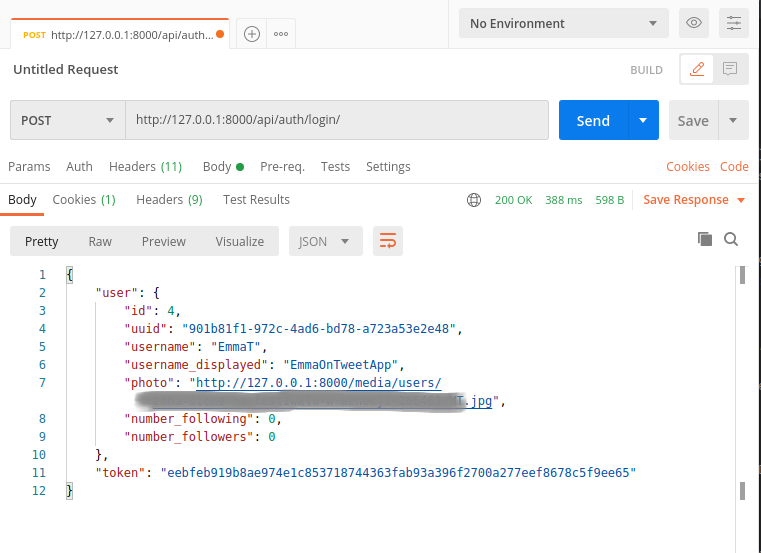
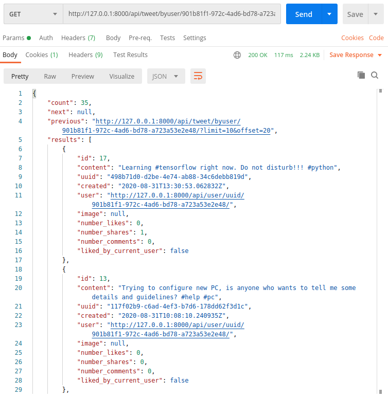

# Social media app Back-end 
Personal project presenting back-end of the application based on twitter functionality. 
(This is NOT Twitter clone)
##  I've created it with:
 * [Django][djangolink]
 * [Django Rest Framework][restframeworklink]
 * [Celery][celerylink] (with [RabbitMQ][rabbitmqlink])
 
 ## Database I used:
 * [PostgreSQL][postgreslink]
 
 All additional extensions and packages can be found in 'requirements.txt'.
 
 ## REST API
 All endpoints are available on `apischema/` url.
 
 
 #### Example queries:
 ##### Successful login response
 
 
 ##### User's tweets and shared tweets
 
 
  ## Authentication and Permission
  Authentication is based on Tokens.
  This solution was picked for security reasons.
  Default permission allows anybody to use Api, therefore
  users who are not logged in can both look over the 
  profiles of other users and search for phrases they look for.
  However, they don't have access to like/comment/share tweets 
  as well as to create their own ones.
  Logged users have access to their profiled newsfeeds, 
  which contain tweets of users they follow.
  Every request that needs permission has to contain token.
  Users can log in with both emails and usernames.
  Client side should prevent from using '@' in the usernames.
  
  ## Hashtag system
  Instead of searching through all posts to find the right ones with given #hashtag,
  server asynchronously creates object of custom data structure 
  which simplifies the subsequent search.
  This solution reduce execution time.
  Endpoint `withhashtag/<str:hashtag>/`.
  
  ## Pagination
  In order to reduce response size of list requests, there was used pagination. 
  It prevents from overloading.
  Every response has link to next/previous page, which can be simply named as
  'load more'. 
  However, newsfeed endpoint takes different approach, the solution is 
  explained in `apischema/`.  
  
  ### Front-end side
  https://github.com/MattSzm/SocialMediaAppFrontend

 [restframeworklink]:https://www.django-rest-framework.org/
 [djangolink]:https://www.djangoproject.com/
 [celerylink]:https://docs.celeryproject.org/en/stable/
 [postgreslink]:https://www.postgresql.org/
 [rabbitmqlink]:https://www.rabbitmq.com/